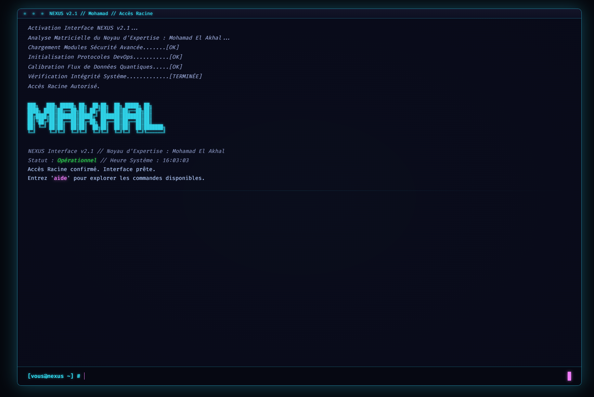

# Portfolio Terminal Interactif



Bienvenue sur **NEXUS**, une simulation de terminal Néo-Rétro qui met en avant mes compétences en Cybersécurité et Infrastructure/DevOps via une interface interactive unique.

## Technologies

*   HTML5
*   CSS3 (Variables, Grid, Flexbox, Animations)
*   JavaScript (ES6 Modules, DOM Manipulation, Canvas API)

## 🚀 Lancement Rapide (Docker Compose)

Ce projet est conçu pour être servi comme un site statique. Le `docker-compose.yml` fourni utilise une image `php:apache` pour servir les fichiers.

1.  **Prérequis :** Assurez-vous d'avoir [Docker](https://docs.docker.com/get-docker/) et [Docker Compose](https://docs.docker.com/compose/install/) installés.
2.  **Structure :** Placez les fichiers du site ( `index.html`, `css/`, `js/` ) dans un dossier `src/` à côté de votre fichier `docker-compose.yml`.
    ```
    nexus-portfolio/
    ├── docker-compose.yml
    └── src/
        ├── index.html
        ├── css/
        │   └── style.css
        └── js/
            ├── main.js
            ├── commands.js
            └── canvas.js
    ```
3.  **Lancer le conteneur :** Depuis le dossier `nexus-portfolio/`, exécutez :
    ```bash
    docker compose up -d
    ```
4.  **Accéder au site :** Ouvrez votre navigateur et allez à l'adresse [http://localhost:8080](http://localhost:8080).

5.  **Arrêter le conteneur :**
    ```bash
    docker-compose down
    ```